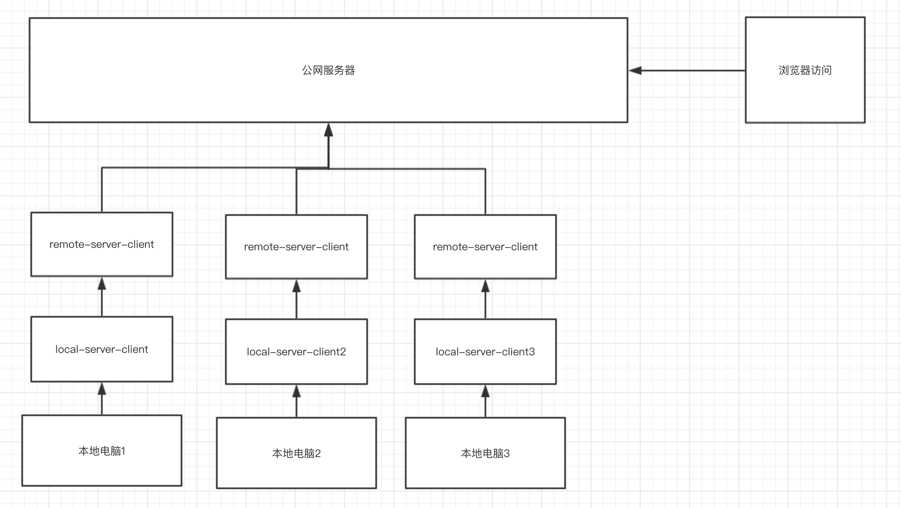

# my-socket-terminal

## 安装依赖
```
npm i
```

# socket.io
```
node index-socket-io.js
```
打开 index-socket-io.html 进行测试


--

>服务器在公网上，一旦开启ws服务，远程就可以获取服务
端数据，世界上任何一台机器都可以。

>但是本地电脑开启ws服务之后，并没有这个功能，
需要借助远程服务器。于是就在本地客户端连接，把本地电脑
数据发送到远程服务器。

### 原理如下: 
让本地电脑的数据 -> 通过本地客户端socket -> 流向服务器


